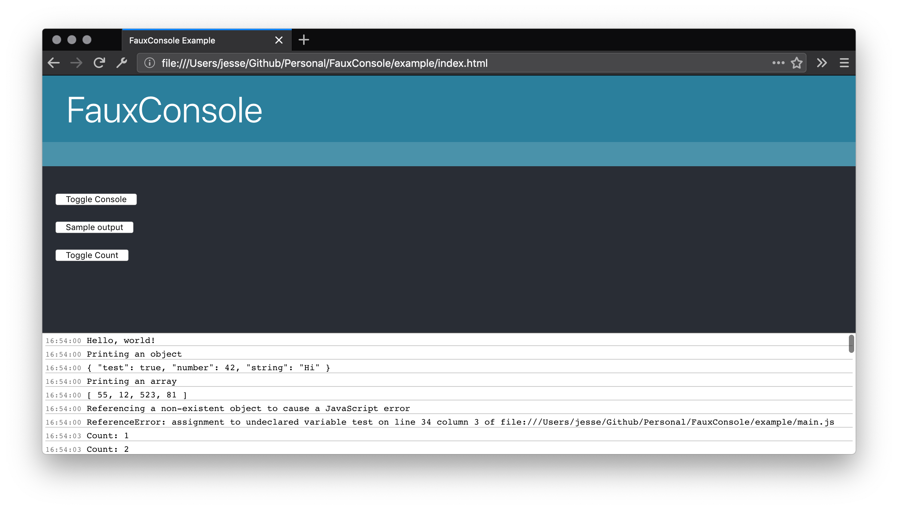

# FauxConsole

> A fake browser console for debugging environments without one

<p align="center">

</p>

## Setup

Include both the JavaScript and CSS dependencies

```html
<script type="text/javascript" src="FauxConsole.js"></script>
<link rel="stylesheet" href="FauxConsole.css" />
```

## Usage

To enable or disable the console, call `FauxConsole.enable()` or `FauxConsole.disable()` respectively.

```javascript
FauxConsole.enable();

// console.log() will now be sent to the FauxConsole instead

console.log('Hello, world!');
console.warn({ test: true });

FauxConsole.disable();

// The system console will receive console.log() commands instead, if it exists
```

## License

MIT © Jesse Youngblood
